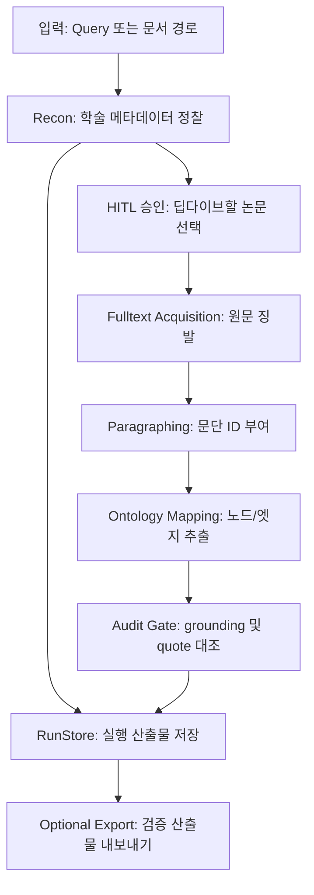

# Omni-Academic Framework 사용자 가이드

이 문서는 `omni-academic-framework`를 실제로 운용하기 위한 상세 매뉴얼이다. 프레임워크의 목적은 학술 질의나 원문 텍스트를 정찰하고, 필요한 경우 원문을 징발한 뒤, 문단 근거에 고정된 온톨로지 맵을 생성하고, 감사 결과가 통과한 산출물만 로컬 지식 저장소로 내보내는 것이다.

현재 상태는 프로토타입 v0.6.0이다. 모든 기능이 완전 자동 연구 에이전트로 닫혀 있는 것은 아니며, HITL 승인, 외부 API 가용성, LLM provider 설정, 원문 접근 가능성에 따라 생성되는 산출물이 달라진다. 이 문서는 구현된 동작을 기준으로 작성한다.

---

## 1. 빠른 시작

프로젝트 루트에서 실행한다.

```bash
uv run omni --status
```

진단 화면에서 API 키, 외부 도구, 로컬 저장소 경로, Git commit 정보를 확인한다. 최초 설정을 대화형으로 진행하려면 다음 명령을 사용한다.

```bash
uv run omni --setup
```

가장 단순한 Mock 실행은 다음과 같다.

```bash
uv run omni "Inflation dynamics" --lens economics --mock
```

이 명령은 기본적으로 `recon` 모듈을 실행한다. `--mock`은 LLM 기반 온톨로지 추출 단계에서 MockProvider를 사용한다는 뜻이지, Recon 네트워크 호출 전체를 오프라인으로 바꾼다는 뜻은 아니다.

완전 오프라인에 가까운 온톨로지 경로만 점검하려면 로컬 텍스트 파일을 대상으로 `ontology` 모듈을 실행한다.

```bash
uv run omni ./examples/sample.md --module ontology --lens general --mock
```

`examples/sample.md`는 repo에 포함된 공개 fixture다. 이 명령은 외부 학술 API를 호출하지 않고, paragraphing -> MockProvider ontology -> AuditGate -> RunStore 저장 경로를 확인한다.

---

## 2. 개념 지도

프레임워크는 고정된 한 줄짜리 파이프라인이 아니라, 필요한 단계까지만 진행하는 점진적 구조다.



주요 단계는 다음과 같다.

| 단계 | 역할 | 주요 산출물 |
|---|---|---|
| Recon | 렌즈별 학술 API/검색 클라이언트로 후보 논문 수집 | `digest.json` |
| HITL | 사용자가 딥다이브할 후보 번호 선택 | `manifest.json` 상태 |
| Scrape | URL/PDF/HTML 원문을 Markdown 텍스트로 징발 | `fulltext.md` |
| Paragraphing | 원문을 문단으로 나누고 `P_0001` 형식 ID 부여 | `paragraphs.json` |
| Ontology | 문단 ID와 근거 인용을 포함한 노드/엣지 생성 | `ontology.json` |
| Audit | paragraph_id와 source_quote를 기계적으로 대조 | `audit.json` |
| Forensic | DOI/URL 실존성 확인, 유령 인용 차단 | `forensic.json` |
| Analyze | 렌즈 focus/prompt와 원문 문단 window를 묶은 분석 준비 brief 생성 | `lens_brief.md` |
| RunStore | 모든 실행의 상태와 산출물을 보존 | `report.md`, `manifest.json`, `runs/index.db` |

---

## 3. 설치와 환경 설정

### 필수 실행 조건

`uv` 기반 실행을 전제로 한다.

```bash
uv run omni --status
uv run python -m pytest
```

기본 의존성은 `pyproject.toml`에 정의되어 있다. 추가 기능은 optional extra로 분리되어 있다.

| Extra | 용도 |
|---|---|
| `semantic-scholar` | Semantic Scholar skill runner 및 `.env` 로딩 보조 |
| `scholar-browser` | Google Scholar HTML 파싱용 BeautifulSoup |
| `llm` | AnthropicProvider 사용 |
| `dev` | 테스트 도구 |

예시:

```bash
uv run --extra llm omni "query" --module ontology
uv run --extra scholar-browser python skills/google-scholar-semantic/scripts/scholar_runner.py --self-test
```

### `.env` 설정

`.env.example`을 기준으로 필요한 값만 채운다.

| 변수 | 용도 | 필수 여부 |
|---|---|---|
| `ANTHROPIC_API_KEY` | 실제 LLM 온톨로지 추출 | 실 LLM 사용 시 필요 |
| `OPENAI_API_KEY` | 향후 확장/보조 모델용 | 선택 |
| `GEMINI_API_KEY` | 향후 확장/보조 모델용 | 선택 |
| `SEMANTIC_SCHOLAR_API_KEY` | Semantic Scholar rate limit 완화 | 선택 |
| `SERPAPI_API_KEY` | Google Scholar API 검색 | 선택 |
| `JINA_API_KEY` | Jina Reader 사용 시 인증 | 선택 |
| `OMNI_LIGHTPANDA_BIN` | Lightpanda 실행 파일 경로 | JS/Scholar 로컬 스크래핑 시 필요 |
| `OMNI_PDF_EXTRACTOR` | 외부 PDF 텍스트 추출기 | 선택 |
| `ACADEMIC_VAULT_PATH` | 검증 산출물 export 대상 로컬 지식 저장소 루트 | export 사용 시 필요 |

경로 규칙은 일관되게 `OMNI_*` 환경변수 우선, 없으면 `PATH` 탐색, 그래도 없으면 해당 기능만 정직하게 실패하는 방식이다.

---

## 4. 실행 명령 레퍼런스

### 시스템 진단

```bash
uv run omni --status
```

확인 항목:

- API key 설정 여부
- Lightpanda/pdftotext 탐지 여부
- 로컬 지식 저장소 경로 유효성
- 현재 Git commit
- 빠른 시작 명령 안내

### 렌즈 목록 확인

```bash
uv run omni --list-lenses
```

`lenses/*.yaml`에 등록된 렌즈 ID, 표시 이름, recon client, focus area를 표로 출력한다. 새 렌즈를 추가한 뒤 CLI에서 인식되는지 확인할 때 유용하다.

### 저장된 run 확인

```bash
uv run omni --show-run exodus-3-19-20
uv run omni --show-run exodus-3-19-20/latest
uv run omni --show-run exodus-3-19-20/MOCK-20260519T094523Z
```

`--show-run`은 로컬 `runs/` 아래의 query slug, `latest` symlink, 전체 run id, 또는 run 디렉터리를 받아 `manifest.json`, `report.md`, artifact 목록을 빠르게 출력한다. 파일을 열지는 않고 경로와 요약만 보여준다.

### Run 무결성 검증

```bash
uv run omni --verify-run exodus-3-19-20
uv run omni --verify-run exodus-3-19-20/latest
uv run omni --verify-run exodus-3-19-20/MOCK-20260519T094523Z
```

`--verify-run`은 `manifest.json`의 `artifact_manifest`를 기준으로 현재 artifact 파일의 존재 여부, byte size, sha256을 다시 계산한다. 누락 또는 변조가 감지되면 non-zero exit code로 실패한다. legacy run처럼 `artifact_manifest`가 없는 경우도 검증 실패로 처리된다.

### 대화형 설정

```bash
uv run omni --setup
```

대화형 프롬프트로 `.env` 값을 입력한다. 빈칸으로 넘기면 기존 값을 유지하거나 생략한다.

### Recon 기본 실행

```bash
uv run omni "Exodus 3:19-20 reception history" --lens theology
```

동작:

1. 렌즈 설정에서 recon client 목록을 읽는다.
2. API/검색 클라이언트를 병렬 호출한다.
3. 후보 논문 digest를 출력한다.
4. 사용자가 번호를 선택하면 원문 징발로 진행한다.
5. `q` 또는 잘못된 입력이면 정찰만 저장하고 종료한다.

### 캐시 우회

```bash
uv run omni "Inflation dynamics" --lens economics --no-cache
```

기본 ReconCache TTL은 24시간이다. `--no-cache`를 쓰면 캐시를 무시하고 fresh 호출을 시도한다.

### Forensic Gate 포함

```bash
uv run omni "Pauline justification ethics" --lens theology --forensic
```

`--forensic`은 recon 후보에 대해 DOI 문법, DOI resolve, URL liveness를 확인한다. error finding이 붙은 후보는 HITL 후보에서 차단된다. 결과는 `forensic.json`과 `manifest.json`에 기록된다.

### Snowball 모드

```bash
uv run omni "ignored query label" --snowball "10.1234/example.doi"
```

키워드 검색 대신 OpenAlex 기반 인용 네트워크 정찰을 수행한다. `query` 인자는 run 이름/메타데이터 용도로 남는다.

### KCI OAI-PMH 수확 모드

```bash
uv run omni "ignored query label" --module recon --kci-harvest ARTI
# set 선택: ARTI(일반 논문) | ARTI_CONF(학술대회) | JOUR(학술지)
```

무키 표준 OAI-PMH(`open.kci.go.kr/oai/request`, `oai_dc`)로 KCI 메타데이터를 set 단위로 수확한다. OAI-PMH는 키워드 검색이 아니라 수확 프로토콜이라 `query` 인자는 run 메타데이터 용도로만 남는다. `resumptionToken` 페이지네이션을 따르며(상한 `MAX_PAGES=50`), 동시에 `--snowball`을 줘도 `--kci-harvest`가 우선한다. 상세 동작은 §6 참조.

### 온톨로지 단독 실행

```bash
uv run omni ./paper.md --module ontology --lens general --mock
```

문서 파일 경로가 존재하면 파일 내용을 읽고, 존재하지 않으면 입력 문자열 자체를 분석 대상으로 사용한다. `--mock`을 붙이면 API 키 없이 구조적 파이프라인과 AuditGate를 점검할 수 있다.

### 렌즈 브리핑 스캐폴드

```bash
uv run omni ./paper.md --module analyze --lens theology
```

현재 LensAnalyzer는 실 LLM 해석 리포트 생성기가 아니다. 대신 렌즈 focus/prompt와 실제 원문 문단 window를 묶은 source-bound briefing scaffold를 출력하고, 같은 내용을 해당 run의 `lens_brief.md` artifact로 저장한다. 이 출력은 후속 분석 준비용이며, 모델이 새 통찰을 생성했다고 간주하면 안 된다.

실 LLM 분석 MVP를 함께 생성하려면 명시적으로 `--llm-analysis`를 붙인다.

```bash
uv run --extra llm omni ./paper.md --module analyze --lens theology --llm-analysis
```

이 모드는 `ANTHROPIC_API_KEY`와 `anthropic` optional extra가 필요하다. 결과는 `lens_analysis.json`과 `lens_analysis.md`로 저장된다. 각 finding은 `paragraph_id`와 verbatim `source_quote`를 포함해야 하며, Gate 3 `LensComplianceAuditor`가 source_quote가 해당 문단에 실제 존재하는지, 렌즈 focus area를 어떻게 다뤘는지, limitations가 기록됐는지 다시 검증한다. Gate 3 결과는 `lens_audit.json`과 manifest의 `lens_audit_passed`에 저장된다. `--mock --llm-analysis`는 네트워크 없이 저장 경로와 grounding 검증만 점검하는 테스트 모드다.

**운용화(operationalization)**: grounding 위반 시 분석기는 구체 오류(어떤 finding의 어떤 quote가 어느 문단에 없는지)를 프롬프트에 피드백해 자동 재시도한다(기본 2회). 시도 횟수와 실제 model·토큰 usage는 manifest `llm_usage`(`analysis`/`critic`, `analysis_attempts`)에 기록된다 — mock 런은 `{"model":"mock","mock":true}`로 낙인되어 실 usage로 위장될 수 없다. 토큰 상한은 `OMNI_LLM_MAX_TOKENS` 환경변수로 조정한다(기본 16000, 최소 1024). 최대 재시도 후에도 grounding이 깨지면 크래시 대신 마지막 리포트를 반환하고 Gate 3가 결정론적으로 실패를 기록한다.

분석 결과에 별도 LLM self-redteaming pass를 붙이려면 `--llm-critic`을 사용한다. 이 옵션은 `--llm-analysis`를 자동 포함한다.

```bash
uv run --extra llm omni ./paper.md --module analyze --lens theology --llm-critic
```

critic 결과는 `lens_critic.json`과 `lens_critic.md`로 저장되며, critic 자체의 paragraph/source_quote도 `lens_critic_audit.json`으로 다시 검증된다. manifest에는 `lens_critic_passed`와 `lens_critic_audit_passed`가 기록된다.

### 검증 산출물 내보내기

```bash
uv run omni ./paper.md --module ontology --lens general --export-vault --vault-path /path/to/knowledge-store
```

내보내기 조건:

- mock run이 아니어야 한다.
- `audit_passed`가 true여야 한다.
- `forensic_passed`가 false이면 거부된다.
- `artifact_manifest` 기준 무결성 검증이 통과해야 한다. export 직전에 artifact 파일의 존재 여부, byte size, sha256을 다시 계산하므로 run 저장 후 파일이 변조되면 내보내기가 거부된다.
- 저장소 루트가 실제 디렉터리여야 한다.

현재 export 경로는 로컬 저장소 루트 아래 `000 System/Inbox/Drafts/`다. 이 경로가 없으면 생성한다.

---

## 5. 렌즈와 Recon 클라이언트

렌즈는 `lenses/*.yaml`에 정의된다. 코드가 특정 학문 분야를 직접 결정하지 않고, 렌즈 설정이 recon client 조합을 주입한다.

현재 포함된 렌즈 파일:

- `general.yaml`
- `theology.yaml`
- `economics.yaml`
- `medical.yaml`
- `humanities.yaml`
- `cs.yaml`

렌즈 파일에서 중요한 필드:

| 필드 | 의미 |
|---|---|
| `name` | 렌즈 표시 이름 |
| `focus_areas` | 분석 초점 목록 |
| `analysis_prompt` | 렌즈 분석 프롬프트 |
| `recon_clients` | Recon에서 사용할 클라이언트 이름 |

알 수 없는 recon client 이름은 경고 후 무시된다. 유효 클라이언트가 하나도 없으면 Crossref가 기본 fallback으로 사용된다.

---

## 6. Google Scholar와 원문 징발 동작

### SerpAPI Google Scholar

`SERPAPI_API_KEY`가 있으면 SerpAPI의 `google_scholar` 엔진을 먼저 호출한다.

`SERPAPI_API_KEY`가 없거나, SerpAPI HTTP/네트워크/응답 오류가 명확히 발생하면 Lightpanda 로컬 폴백을 시도한다.

```bash
OMNI_LIGHTPANDA_BIN=/path/to/lightpanda uv run omni "query" --lens general
```

주의:

- SerpAPI가 정상 응답을 반환했지만 결과가 0건인 경우에는 정상 무결과일 수 있으므로 Lightpanda를 무조건 재호출하지 않는다.
- Lightpanda가 없으면 Google Scholar local fallback은 빈 결과를 반환한다.
- HTML 구조 변경이나 차단으로 파싱 결과가 비어 있을 수 있다.

### 원문 스크래퍼 선택

원문 URL 승인 뒤 `ScraperFactory.detect()`가 먼저 HEAD 요청으로 Content-Type을 확인한다.

| 조건 | 스크래퍼 |
|---|---|
| Content-Type이 PDF 또는 URL path가 `.pdf` | `PdfExtractorScraper` |
| `doi.org`, `sciencedirect`, `kci.go.kr` 등 | `LightpandaScraper` |
| 그 외 HTML/텍스트 URL | `JinaReaderScraper` |

PDF 추출 우선순위:

1. `OMNI_PDF_EXTRACTOR` 외부 도구
2. 내장 `pypdf`
3. 둘 다 실패하면 빈 문자열 반환

---

## 7. RunStore 산출물 해석

모든 실행은 `runs/<query-slug>/<timestamp>/` 형태로 저장된다. Mock run은 timestamp 앞에 `MOCK-` prefix가 붙는다.

예시:

```text
runs/
├── index.db
└── exodus-3-19-20/
    ├── MOCK-20260519T094024Z/
    ├── 20260519T101010Z/
    └── latest -> 20260519T101010Z
```

### `manifest.json`

핵심 메타데이터:

| 필드 | 의미 |
|---|---|
| `run_id` | `query-slug/timestamp` 형식 실행 ID |
| `created_at` | UTC ISO timestamp |
| `query` | 입력 query 또는 문서 경로 |
| `lens` | 사용한 렌즈 |
| `mock` | MockProvider 사용 여부 |
| `git_commit` | 실행 당시 Git commit |
| `audit_passed` | AuditGate 통과 여부 |
| `lens_audit_passed` | `--llm-analysis` 실행 시 Gate 3 LensComplianceAuditor 통과 여부 |
| `lens_critic_passed` | `--llm-critic` 실행 시 LLM critic 자체의 통과 여부 |
| `lens_critic_audit_passed` | critic 결과의 paragraph/source_quote grounding 감사 통과 여부 |
| `status` | 표준 실행 상태. 현재 값: `running`, `completed`, `failed`, `no_papers_found`, `cancelled_by_user`, `invalid_choice`, `scraper_detection_failed`, `scraping_failed`, `analysis_failed`, `unknown` |
| `recon_cache` | client별 캐시 hit/age 정보 |
| `artifacts` | 실제 생성된 파일 목록 |
| `artifact_manifest` | artifact별 `exists`, `bytes`, `sha256` 무결성 정보 |

### `report.md`

사람이 빠르게 읽는 요약 파일이다.

포함 내용:

- executive summary: status, query, lens, mock/live, audit, forensic 상태
- provenance: run id, 생성 시각, Git commit, run directory
- artifact index: `digest.json`, `ontology.json`, `audit.json` 등 상대 링크
- analyze run에서는 `lens_brief.md` 상대 링크
- `--llm-analysis` 실행 시 `lens_analysis.json`, `lens_analysis.md`, `lens_audit.json` 상대 링크
- `--llm-critic` 실행 시 `lens_critic.json`, `lens_critic.md`, `lens_critic_audit.json` 상대 링크
- recon cache provenance: client별 hit/miss와 cache age
- recon 후보 요약: 저자, venue, citation count, DOI/URL, abstract excerpt
- ontology node/edge 요약: class, paragraph_id, source_quote excerpt, relation reasoning
- audit status 및 score
- audit findings
- forensic findings
- lens compliance findings
- 실패 run의 경우 failure diagnostics: 상태별 가능 원인, 기록된 error message, forensic 차단 수

정밀 재현이나 프로그램 처리에는 `report.md`보다 JSON 파일을 우선 사용한다.

### `paragraphs.json`

`P_0001`, `P_0002` 같은 paragraph ID와 실제 문단 텍스트의 mapping이다. AuditGate는 이 map을 사용해 ontology node의 `paragraph_id`와 `source_quote`를 검증한다.

### `ontology.json`

주요 구조:

| 필드 | 의미 |
|---|---|
| `nodes[].id` | 노드 ID |
| `nodes[].label` | 개념/인물/방법/자료 등 이름 |
| `nodes[].entity_class` | 범용 entity class |
| `nodes[].paragraph_id` | 근거 문단 ID |
| `nodes[].source_quote` | 해당 문단에 실제 존재해야 하는 verbatim 인용 |
| `edges[].source_id` | 출발 노드 |
| `edges[].target_id` | 도착 노드 |
| `edges[].predicate` | 관계 predicate |
| `edges[].reasoning` | 관계 근거 설명 |
| `edges[].source_quote` | 원문에 실제 존재해야 하는 관계 근거 인용 |

---

## 8. Audit와 Forensic Gate

### AuditGate

AuditGate는 화려한 답변을 평가하는 LLM judge가 아니라 기계적 대조 계층이다.

검사 항목:

- self-loop edge
- dangling edge
- weak reasoning
- orphan node
- paragraph manifest 존재 여부
- node paragraph_id 실존 여부
- node source_quote가 해당 문단에 실제 포함되는지
- edge source_quote가 원문 corpus에 실제 포함되는지
- source_quote가 너무 짧거나 너무 길어 검증력이 약하지 않은지
- 여러 node/edge가 같은 source_quote를 반복 재사용하지 않는지
- edge source_quote가 source/target node의 문단 중 하나에 연결되는지

점수 계산:

- error 1개당 25점 감점
- warning 1개당 10점 감점
- error가 하나라도 있으면 `passed=false`
- warning만 있으면 score가 낮아져도 `passed=true`일 수 있다.

### ForensicAuditor

`--forensic` 옵션을 사용할 때 recon 후보에 대해 작동한다.

검사 항목:

- DOI 문법
- DOI resolve 여부
- URL HEAD 요청 liveness

error finding에서 `source_ref`가 `paper[<idx>]` 형식이면 해당 후보는 HITL 선택 목록에서 차단된다.

---

## 9. 로컬 DB 조회

실행 이력은 `runs/index.db`에 저장된다. 간단 조회는 helper CLI를 사용한다.

전체 목록:

```bash
uv run python src/store/query_db.py
```

렌즈 필터:

```bash
uv run python src/store/query_db.py economics
```

렌즈 이름은 하드코딩 목록이 아니라 `lenses/*.yaml`에서 읽는다.

쿼리 문자열 부분 검색:

```bash
uv run python src/store/query_db.py "Exodus"
```

직접 SQL:

```bash
uv run python src/store/query_db.py "SELECT * FROM runs WHERE mock = 0 AND audit_passed = 1"
```

직접 SQL은 `SELECT`로 시작하는 단일 조회문만 의도한다. 운영상 쓰기/변경 목적의 SQL은 사용하지 않는다.

자주 쓰는 필터:

```bash
# audit 통과 + live run만 최신 10건
uv run python src/store/query_db.py --passed --live --limit 10

# 최신 run 1건을 JSON으로 출력
uv run python src/store/query_db.py --latest --json

# 특정 키워드 + mock run만 조회
uv run python src/store/query_db.py "Exodus" --mock

# DB 경로를 명시해 조회
uv run python src/store/query_db.py --db runs/index.db --failed
```

필터 옵션:

| 옵션 | 의미 |
|---|---|
| `--passed` | `audit_passed = 1` |
| `--failed` | `audit_passed = 0` |
| `--mock` | `mock = 1` |
| `--live` | `mock = 0` |
| `--latest` | 최신 1건만 조회 |
| `--limit N` | 최대 N건 조회 |
| `--json` | 표 대신 JSON 배열 출력 |
| `--db PATH` | 기본 `runs/index.db` 대신 다른 DB 조회 |
| `--status VALUE` | 표준 `status` 값으로 조회. 오타 값은 argparse 단계에서 거부 |
| `--forensic-passed` | `forensic_passed = 1` |
| `--forensic-failed` | `forensic_passed = 0` |

새 run이 finalize되면 `runs/index.db`는 자동으로 `status`, `forensic_passed`, `artifacts_count` 컬럼을 보유하도록 마이그레이션된다. 기존 legacy DB에 아직 해당 컬럼이 없다면 `--status`와 forensic 필터는 사용할 수 없다.

---

## 10. 로컬 지식 저장소 Export

Export는 opt-in이다. `--export-vault`를 명시해야 한다.

```bash
uv run omni ./paper.md --module ontology --lens general --export-vault --vault-path /path/to/knowledge-store
```

또는 `.env`에 기본 경로를 둔다.

```env
ACADEMIC_VAULT_PATH=/path/to/knowledge-store
```

그 뒤:

```bash
uv run omni ./paper.md --module ontology --lens general --export-vault
```

차단 조건:

- 경로 미지정
- 경로가 실제 디렉터리가 아님
- mock run
- audit 미통과
- forensic 실패가 manifest에 기록됨

export 파일명은 `run_id`의 `/`를 `__`로 치환해 파일 경로 충돌을 피한다.

export draft에는 다음 요약이 포함된다.

- run metadata
- ontology node/edge 상위 20개
- audit finding 상위 20개
- 원본 artifact 경로(`report.md`, `manifest.json`, `ontology.json`, `audit.json`)

완전한 원천 데이터는 export draft가 아니라 `runs/<query>/<timestamp>/`의 JSON artifact를 기준으로 확인한다.

---

## 11. 유지관리와 정리

GitHub에 올리면 안 되는 로컬 자료는 `.gitignore`에 등록되어 있다.

무시되는 주요 경로:

- `.env`
- `.venv/`
- `.cache/`
- `runs/`
- `handoff/`
- `scratch/`
- `.DS_Store`
- `__pycache__/`

로컬에 남겨도 되는 자료:

- `runs/`: 실행 산출물과 report
- `handoff/`: 피어리뷰/인수인계 문서
- `.env`: 로컬 API 키와 경로 설정
- `.cache/`: recon 응답 캐시

정리해도 되는 생성물:

- `.DS_Store`
- `.pytest_cache/`
- 프로젝트 코드/테스트 아래의 `__pycache__/`

주의:

- `.env`는 삭제하면 로컬 설정이 사라진다.
- `runs/index.db`는 삭제하면 실행 이력 조회가 사라진다.
- `runs/<query>/latest`는 symlink라 삭제해도 다음 실행 때 다시 생길 수 있지만, 수동 삭제는 보통 필요 없다.

---

## 12. 문제 해결

### `검색된 논문이 없습니다`

가능한 원인:

- 네트워크 오류
- lens의 recon client가 빈 결과 반환
- SerpAPI key 없음 + Lightpanda 없음
- API rate limit
- 캐시가 빈 결과를 보관 중

대응:

```bash
uv run omni "query" --lens general --no-cache
uv run omni --status
```

### 원문 스크래핑 실패

가능한 원인:

- URL 없음
- DOI landing page가 브라우저 렌더링 필요
- Lightpanda 미설정
- PDF가 스캔 이미지 또는 암호화됨
- Jina Reader 접근 실패

대응:

```bash
uv run omni --status
```

필요하면 `OMNI_LIGHTPANDA_BIN` 또는 `OMNI_PDF_EXTRACTOR`를 설정한다.

### Ontology 추출 불가

가능한 원인:

- 실 LLM provider API key 없음
- provider 패키지 미설치
- 원문이 비어 있음

대응:

```bash
uv run omni ./paper.md --module ontology --mock
uv run --extra llm omni ./paper.md --module ontology
```

### export가 거부됨

가능한 원인:

- mock run
- audit 실패
- forensic 실패
- 로컬 저장소 경로 미설정

대응:

```bash
uv run omni --status
uv run python src/store/query_db.py "SELECT run_id, audit_passed, dir FROM runs ORDER BY created_at DESC"
```

### 테스트가 실패함

전체 테스트:

```bash
uv run python -m pytest
```

특정 파일:

```bash
uv run python -m pytest tests/test_run_store.py
```

---

## 13. 현재 한계

현재 구현 기준 한계:

- 기본 LensAnalyzer는 실 LLM 해석 리포트 생성기가 아니라 source-bound briefing scaffold를 출력한다. 실 LLM 분석은 `--llm-analysis`로 명시해야 한다.
- Gate 3의 기본 감사는 deterministic Lens Compliance MVP다.
- `--llm-critic`은 critic 결과를 저장하고 감사하지만, critic 결과를 바탕으로 자동 재작성하는 수정 루프는 아직 없다.
- Google Scholar HTML 파싱은 외부 사이트 구조 변화에 취약하다.
- KCI는 키 가용성에 따라 3경로로 동작하며(Open API 키는 일반 사용자에게 비공개·기관/제한), 전부 부재 시 신학·인문학 렌즈는 OpenAlex+Crossref로 graceful degrade(렌즈 안 깨짐):
  - **OAI-PMH 수확(권장·무키 표준)**: `uv run omni <q> --module recon --kci-harvest ARTI`(또는 `ARTI_CONF`/`JOUR`). base `https://open.kci.go.kr/oai/request`는 실검증(2026-05) 무인증·`oai_dc` 표준. OAI-PMH는 키워드 검색이 아니라 set 단위 *수확* 프로토콜이라 `BaseAPIClient(search)`를 상속하지 않는 별도 모드(Snowball과 동일 원칙).
  - **파서**: OAI-PMH 2.0+Dublin Core 표준 경로만 사용(네임스페이스 무력화), 검증된 식별자 체계 `oai:kci.go.kr:ARTI/{artiId}`로 landing URL 구성, 표준 fixture 스냅샷 고정. deleted 레코드·OAI error 봉투 정직 처리. `resumptionToken` 추종(후속 요청은 `verb`+`resumptionToken`만), `MAX_PAGES=50` 상한·토큰 반복 차단·네트워크 실패 시 부분 반환.
  - **Open API(키 보유 시)**: `KCI_API_KEY` 설정 시 실 `<MetaData>` 구조 검증, 키 누락 시 `resultMsg` 에러봉투 정직 처리.
  - **Lightpanda 키워드 우회**: 키 없으면 JS 렌더 웹검색을 headless로 우회(`OMNI_LIGHTPANDA_BIN` 필요). 셀렉터(`a.subject`, `ul.subject-info`의 `poCretDetail` 저자 / `ciSereInfoView` 학술지)는 실 렌더 DOM 캡처로 검증, `test_kci.py` 실 fragment 스냅샷 고정. 목록뷰 무초록은 정직하게 미제공 표기. Lightpanda도 없으면 빈 결과.
- Audit score 80 미만 자체는 export 차단 조건이 아니다. 차단은 `audit_passed=false` 또는 forensic 실패 기준이다.
- `runs/`와 `.cache/`는 로컬 산출물이며 GitHub에 올리지 않는다.

---

## 14. 권장 운영 루틴

1. `uv run omni --status`로 환경을 확인한다.
2. `uv run omni "query" --lens <lens> --forensic`으로 후보를 정찰한다.
3. HITL에서 딥다이브할 후보를 고른다.
4. 원문 징발과 ontology/audit 결과를 `runs/<query>/latest/report.md`에서 확인한다.
5. JSON 원천 파일이 필요하면 `digest.json`, `ontology.json`, `audit.json`, `manifest.json`을 확인한다.
6. 로컬 저장소로 승격할 경우 mock이 아닌 실 run에서 `--export-vault`를 사용한다.
7. 변경 후 `uv run python -m pytest`로 회귀를 확인한다.
