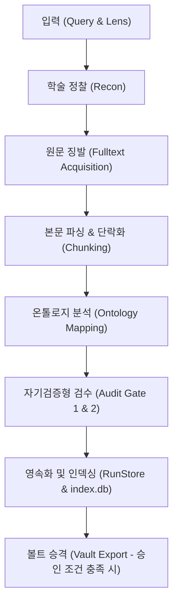

# Omni-Academic Framework 사용자 가이드 (User Guide)

본 문서는 학술적 지문 분석, 문헌 징발, 온톨로지 매핑 및 자기검증형 승격 파이프라인을 다루는 `omni-academic-framework` 프로젝트의 종합 운용 매뉴얼이다.

---

## 1. 핵심 아키텍처 개요

본 프레임워크는 연구 타겟(성경 구절, 학술 키워드 등)을 전달받아 자료 징발부터 최종 아카이빙까지의 과정을 아래와 같은 5단계 파이프라인으로 처리한다.



---

## 2. 디렉토리 구조 및 런 영속화 (RunStore)

프레임워크의 모든 실행 결과(Run)는 개별 실행 단위로 완전히 격리되어 `runs/` 아래 저장된다.

### 물리 디렉터리 레이아웃
*   **쿼리별 슬러그 폴더 계층화**: 난립하던 플랫 폴더 대신 쿼리 텍스트를 정규화한 슬러그 폴더(예: `runs/inflation-dynamics/`) 아래 개별 실행 타임스탬프 폴더가 생성된다.
*   **최신 런 상대 참조 (`latest`)**: 매 실행마다 해당 쿼리 슬러그 디렉터리 내에 가장 최근 실행된 디렉터리를 가리키는 `latest` 상대 경로 심볼릭 링크가 자동 갱신된다.

```
runs/
├── index.db                       # 전체 실행 이력 추적용 SQLite3 데이터베이스
└── inflation-dynamics/            # 쿼리 슬러그 디렉터리
    ├── MOCK-20260519T082328Z/     # 과거 런
    ├── MOCK-20260519T082601Z/     # 과거 런
    └── latest -> MOCK-20260519T082601Z  # 최신 실행 디렉터리를 가리키는 심볼릭 링크
```

### 개별 런 폴더 내부의 7대 아티팩트
각 실행 폴더에는 가동 과정에서 생성된 모든 원천 자료와 리포트가 보존된다.
1.  **`digest.json`**: 구글 스콜라, OpenAlex 등에서 수집한 논문 메타데이터 목록.
2.  **`fulltext.md`**: 징발에 성공한 실물 PDF/HTML 문헌의 마크다운 덤프 텍스트.
3.  **`paragraphs.json`**: 온톨로지 분석을 위해 원문을 논리적 단락 단위로 쪼갠 구조화 데이터.
4.  **`ontology.json`**: 징발 텍스트에서 AI 렌즈를 통해 추출한 의미론적 개념 노드 및 관계(Edges) 파일.
5.  **`audit.json`**: 산출물의 무손실성 및 환각(Hallucination) 방지를 검증한 Audit 보고서.
6.  **`report.md`**: 사람이 읽기 좋은 형태로 가공된 실행 요약 리포트 (시각화 마크다운).
7.  **`manifest.json`**: Mock 여부, Git 커밋 해시, 실행 정보 및 산출물 체크섬을 담은 메타데이터.

---

## 3. 이중 데이터베이스 & 캐시 레이어

프레임워크는 학술 정찰의 안정성을 높이고 실행 데이터를 관리하기 위해 두 개의 독립된 SQLite 데이터베이스를 운용한다.

```
프로젝트 루트/
├── runs/
│   └── index.db         # [1] 런 이력 영속화 원장 (Append-Only)
└── .cache/
    └── recon.sqlite     # [2] 외부 API 응답 캐시 (레이트리밋 & 밴 차단용)
```

### [1] 런 이력 원장: `runs/index.db`
모든 성공적인 실행 이력과 아티팩트 물리 경로가 이 테이블에 영속화된다.
*   **테이블 스키마**:
    ```sql
    CREATE TABLE runs (
        run_id TEXT PRIMARY KEY,   -- 예: "inflation-dynamics/MOCK-20260519T082601Z"
        created_at TEXT,           -- ISO 8601 타임스탬프
        query TEXT,                -- 원본 검색 질의어
        lens TEXT,                 -- 적용된 학술 렌즈 (economics, law 등)
        mock INTEGER,              -- 1 (Mock 실행), 0 (실제 LLM 가동)
        audit_passed INTEGER,      -- 1 (검수 통과), 0 (실패), NULL (검사 안함)
        dir TEXT                   -- 실제 아티팩트가 위치한 물리 경로
    );
    ```

*   **학문 분야별 격리 쿼리 팁**:
    에이전트에게 쿼리를 요청하거나 직접 DB에 접속할 때 아래 조건들을 활용할 수 있다.
    *   *특정 분야(렌즈) 조회*: `WHERE lens = 'economics'`
    *   *실제 구동 결과만 필터링*: `WHERE mock = 0`
    *   *검수 통과 아티팩트 탐색*: `WHERE audit_passed = 1`

### [2] API 응답 캐시: `.cache/recon.sqlite`
외부 학술 검색 서버(구글 스콜라, OpenAlex 등)에 대한 무차별적인 요청을 방지하고 캐시 생존 주기(기본 24시간) 동안 응답을 재사용한다.
*   학술 데이터의 최신 신선도 유지와 밴 방지를 균형 있게 제어하며, 캐시 적중 여부는 개별 런의 `manifest.json` 내부에 프로비넌스(Provenance) 기록으로 투명하게 추적된다.

---

## 4. 핵심 기능 운용 가이드

### ① 외부 API Key가 없는 경우의 구글 스콜라 정찰 폴백
SerpApi 등 외부 검색 API 키가 시스템 환경 변수에 주입되어 있지 않거나 쿼터가 만료된 경우, 프레임워크는 로컬의 **헤드리스 브라우저 스크래퍼(Playwright/Lightpanda 기반)**로 자동 전환된다.
*   동작 프로세스: API 무반응 감지 -> 로컬 스크래퍼 가동 -> 구글 스콜라 직접 정찰 및 PDF 직통 URL 획득 -> 징발 파이프라인 연계.

### ② 오프라인 Mock 테스트 모드 (`--mock`)
실제 프론트 LLM(Anthropic 등) 과금을 방지하고 파이프라인의 구조적 무결성을 테스트하기 위한 격리 실행 방식이다.
*   **명령 예시**: `python3 src/supervisor/status.py --query "Inflation dynamics" --lens "economics" --mock`
*   **특징**: 온톨로지 생성 단계에서 Mock 데이터를 생성하지만, 구글 스콜라 정찰(Recon)과 본문 징발(`fulltext.md` 생성)은 **실제 라이브 웹 데이터**를 사용하여 수행하므로 신뢰성 있는 원문 획득 테스트가 가능하다.

### ③ 로컬 지식 저장소(Obsidian Vault 등) 안전 승격 규칙
검증이 완전히 끝난 고품질 산출물만 지정된 로컬 지식 저장소(Obsidian Vault)의 임시 수신함(Inbox) 경로로 안전하게 내보내어(Export) 결합할 수 있도록 설계된 안전장치이다.
*   **승격 불허(Reject) 조건**:
    *   `--mock` 모드로 실행된 아티팩트인 경우
    *   `audit_passed` 검수 결과가 `False` 이거나 스코어가 80점 미만인 경우
    *   원문에 존재하지 않는 유령 인용이 검출된 경우 (Gate 2 Forensic 실패)
*   **동작**: 이 조건 중 하나라도 위배되면 지식 저장소 오염을 방지하기 위해 파일 쓰기 진입 자체가 원천 거부된다.

---

## 5. 데이터베이스 직접 조회 가이드 (`query_db.py`)

사용자는 터미널 CLI 환경 혹은 에이전트 자연어 번역을 통해 인덱스 DB(`runs/index.db`)를 유연하게 조회할 수 있다.

### ① 로컬 간편 조회 CLI 유틸리티 (`src/store/query_db.py`)
프로젝트 루트에서 다음 명령어를 실행하여 런 목록을 필터링 및 조회할 수 있다.

*   **전체 실행 목록 조회**:
    ```bash
    python3 src/store/query_db.py
    ```
*   **학문 분야(렌즈)로 필터링**:
    ```bash
    python3 src/store/query_db.py economics
    ```
*   **검색 질의어(Query) 키워드로 부분 매칭 검색**:
    ```bash
    python3 src/store/query_db.py "Inflation"
    ```
*   **원시 SQL 쿼리 직접 수행 (SELECT로 시작)**:
    ```bash
    python3 src/store/query_db.py "SELECT * FROM runs WHERE mock = 0 AND audit_passed = 1"
    ```

### ② 에이전트 대리 자연어 쿼리
사용자가 에이전트(Antigravity)에게 대화창을 통해 자연어로 원하는 탐색 조건을 지시하면, 에이전트가 이를 SQL로 변환하여 로컬 `runs/index.db`에 직접 쿼리를 실행한 뒤 결과를 정돈하여 보고한다.
*   *예시 지시*: "economics 렌즈로 수행된 런 중에 audit을 통과한 기록만 전부 가져와줘"

